# 웹페이지 구축을 위한 CSS3(색상과 배경)

## 배경 스타일 시트

background-color : 배경색
background-image : 배경 이미지 지정
background-repeat : 배경 이미지 반복
background-attachment : 배경 이미지 고정
background-position : 배경 이미지 위치
background : 배경 이미지

### 1. background-color

- 이 속성은 배경색을 지정하는 것으로, 원하는 배경색을 지정하거나 따로 지정하지 않으면 문서의 배경색이 투명하게 비치게 된다.


```html
<META charset=utf-8>
<STYLE TYPE="text/css">
    P {
        font-size: 26px
    }

    H3 {
        color: #ffffff
    }

    .bgyellow {
        background-color: #FFFF00
    }

    .bggreen {
        background-color: #7DF97D
    }
</STYLE>

<BODY background="img_02.jpg">
    <H3>배경 속성이란? </H3>

    <span class="bgyellow">이 배경 속성은 기본적으로 투명하다는 특성을 지닌다.</span>
    <p>예를 들어,a 배경색이나 배경 이미지가 있는 웹 문서에 표를 삽입하면 </p>
    <p>그 표의 배경은 기본적으로
        <span class="bggreen">투명하기 때문에</span>
    </p>
    <p>
        <span class="bgyellow">문서의 배경색이나 배경 이미지가 그대로 드러난다.</span>
    </p>
</BODY>
```

### 2. background-image

- 이 속성은 요소의 배경 이미지를 지정한다.
- 배경 이미지를 지정할 때는 혹시 그 이미지가 없을 경우를 대비해서 배경색도 함께 지정해 놓는 것이 좋다.
- 배경색을 지정 했더라도 배경 이미지가 있으면 배경 이미지가 배경색을 덮어쓰게 되는 것이다.

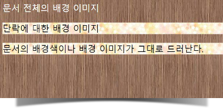

```html
<META charset=utf-8>
<STYLE>
    .a {
        color: #ffffff;
        font-size: 24px;
    }

    P {
        background-image: url("pattern_d.jpg");
        font-size: 24px;
    }

    BODY {
        background-image: url("pattern_e.jpg");
    }
</STYLE>

<BODY>
    <span class=a>문서 전체의 배경 이미지</span>
    <p>단락에 대한 배경 이미지</p>
    <p>문서의 배경색이나 배경 이미지가 그대로 드러난다.</p>
</BODY>
```

### 3. background-repeat

- 이 속성은 배경 이미지를 사용할 경우 그 이미지를 반복시킬 것인지, 반복한다면 어느 방향으로 반복할 것인지를 지정한다.

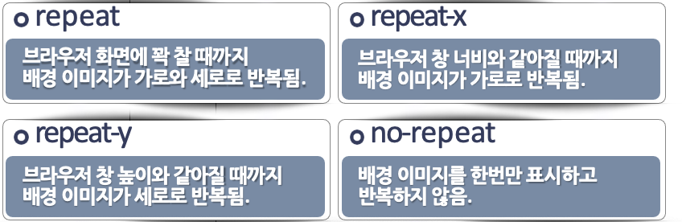

### 4. background-attachment

- 배경 이미지가 지정되면 이 속성을 사용해서 배경 이미지를 고정할 것인지 여부를 결정할 수 있다.
- 배경 이미지를 고정시키게 되면 웹 페이지를 아무리 스크롤 하더라도 배경 이미지는 스크롤 되지 않고 내용만 스크롤 되기 때문에 마치 배경 이미지 위로 다른 내용들이 스크롤 되는 것처럼 보인다.
- 사용 가능 값 : scroll, fixed (초기 값 : scroll)

### 5. background-position

- 배경 이미지가 지정되었으면 이 속성을 사용해서 배경 이미지의 위치를 조절할 수 있다.
- 이 속성은 특히 배경 이미지를 한 번만 표시하면서 배경 이미지를 특정한 위치에 배치하려고 할 때 유용하다.
- 백분율 백분율(% %)
    - 만일 이 속성의 값이 ‘0% 0%’ 라면 배경 이미지가 사용되는 요소의 크기를 기준으로 0%인 곳이므로 배경 이미지의 좌측과 상단의 여백이 요소의 좌측과 상단에 맞춰 배치된다.
    - 만일 이 속성 값이 ‘100% 100%'라면 배경 이미지의 위치는 요소 의 우측하단 모서리에 맞춰 배치하게 될 것이다.
    - 만일 ‘50% 50%'라면 이것은 배경 이미지의 위치를 요소의 가로, 세로 50% 되는 위치에 맞춘다는 뜻이다.
- 길이 길이
    - 예를 들어 background-position:3cm 3cm 라고 되어 있다면 이것은 배경 이미지의 위치를 요소의 가로 3cm, 세로 3cm에 맞추라는 뜻이다.
- 키워드(left, center, right, top, center, bottom)
    - 키워드를 사용하는 방법이 가장 많이 사용하는 방법이다.
    - 수평 배치 방법은 left와 center, right 중에서 선택할 수 있고 수직 배치 방법은 top과 center, bottom 중에서 선택할 수 있다.
    - 예를 들어, background-position : right bottom 이라고 되어 있다면 배경 이미지를 브라우저 창의 오른쪽 아래 부분에 배치하는 것이다.
    - 그리고 background-position: center center 일 경우 background-position: center 처럼 값을 하나만 사용하기도 한다.

### 6. background

- 이 속성은 지금까지 설명한 배경과 관련된 속성, 즉 background-color, background- image, background-repeat, background-attachment, background-position을 한꺼번에 설정하는 것이다.
- background에서 사용할 수 있는 값들은 각 속성들에서 사용할 수 있는 값을 모아놓은 것이다.

# 그러데이션

- 그러데이션은 크기가 없는 배경 이미지이므로 background-image나 background 속성에서 사용
- 그러데이션 속성은 표준화 됨
- 하지만 구형 모던 브라우저에서는 브라우저 접두사를 붙여야 동작함
- 수직 방향이나 수평 방향으로, 혹은 대각선 방향으로 색상이 일정하게 변하는 것
- 선형 그러데이션을 지정할 때는 방향과 색상이 필요하다

## 선형 그러데이션 1)방향

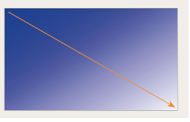

```html
<style>
    .grad {
        background: blue;
        background: -webkit-linear-gradient(left top, blue, white);
        background: -moz-linear-gradient(right bottom, blue, white);
        background: -o-linear-gradient(right bottom, blue, white);
        background: linear-gradient(to right bottom, blue, white);
    }
</style>

<div class="grad"></div>
```

## 선형 그러데이션 2)각도

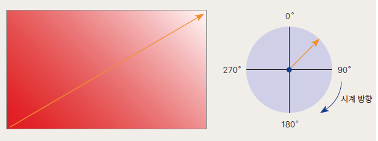

```html
<style>
    .grad {
        /* 45도 (오른쪽 위) 방향으로, 빨강에서 흰색으로 */
        background: #ff0000;
        /* CSS3 미지원 브라우저*/
        background: -webkit-linear-gradient(45deg, #ff0000, #ffffff);
        /* 초기 모던 브라우저 */
        background: -moz-linear-gradient(45deg, #ff0000, #ffffff);
        /* 초기 모던 브라우저 */
        background: -o-linear-gradient(45deg, #ff0000, #ffffff);
        /* 초기 모던 브라우저 */
        background: linear-gradient(45deg, #ff0000, #ffffff);
        /* 최신 모던 브라우저 */
    }
</style>

<div class="grad"></div>
```

## 선형 그러데이션 3)색상 중지점

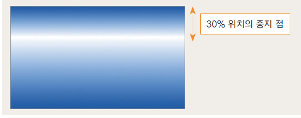

```html
<style>
    .grad {
        background: #06f;
        /* css3 미지원 브라우저 */
        background-image: -webkit-linear-gradient(top, #06f, white 30%, #06f);
        /* 초기 모던 브라우저 */
        background-image: -moz-linear-gradient(bottom, #06f, white 30%, #06f);
        /* 초기 모던 브라우저 */
        background: -o-linear-gradient(bottom, #06f, white 30%, #06f);
        /* 초기 모던 브라우저 */
        background: linear-gradient(to bottom, #06f, white 30%, #06f);
        /* 최신 모던 브라우저 */
    }
</style>
```

## 원형 그러데이션 1) 모양

- 원형 그러데이션에서 만들어지는 모양은 circle(원형)과 ellipse(타원형)
- 따로 지정하지 않으면 ellipse로 인식
    
    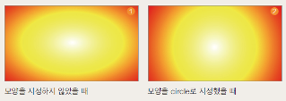
    

```html
<style>
    .grad1 {
        background: red;
        background: -webkit-radial-gradient(white, yellow, red);
        background: -moz-radial-gradient(white, yellow, red);
        background: -o-radial-gradient(white, yellow, red);
        background: radial-gradient(white, yellow, red);
    }

    .grad2 {
        background: red;
        background: -webkit-radial-gradient(circle, white, yellow, red);
        background: -moz-radial-gradient(circle, white, yellow, red);
        background: -o-radial-gradient(circle, white, yellow, red);
        background: radial-gradient(circle, white, yellow, red);
    }
</style>
```

## 원형 그러데이션 2)위치

- 그러데이션이 시작하는 원의 중심 지정
- [표준 구문] ‘모양’과 ‘크기’ 속성 다음에 at 키워드와 함께 위치 값 지정
- [접두사 구문] at 키워드 없이 구문의 맨 앞에 위치 값 지정
- 사용할 수 있는 값 : 키워드(left, center, right 중 하나, top, center, bottom 중 하나)나 백분율
    
    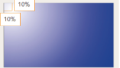
    

```html
<style>
    .grad {
        background: blue;
        background: -webkit-radial-gradient(10% 10%, circle, white, blue);
        background: -moz-radial-gradient(10% 10%, circle, white, blue);
        background: -o-radial-gradient(10% 10%, circle, white, blue);
        background: radial-gradient(circle at 10% 10%, white, blue);
    }
</style>
```

## 그러데이션 3)크기

- 그러데이션 원의 크기 지정

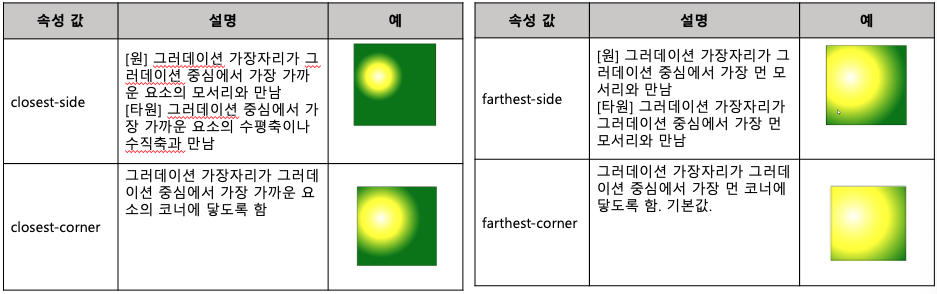

## 그러데이션 4)색상 중지점

- 색상이 바뀌는 지점
- 색상만 지정할 수도 있고 색상과 함께 중지 점의 위치도 함께 지정할 수도 있음.
    
    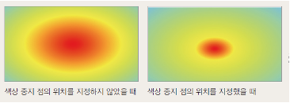
    

```html
<style>
    .grad1 {
        background: skyblue;
        background: -webkit-radial-gradient(red, yellow, skyblue);
        background: -moz-radial-gradient(red, yellow, skyblue);
        background: -o-radial-gradient(red, yellow, skyblue);
        background: radial-gradient(red, yellow, skyblue);
    }

    .grad2 {
        background: skyblue;
        background: -webkit-radial-gradient(red, yellow 20%, skyblue);
        background: -moz-radial-gradient(red, yellow 20%, skyblue);
        background: -o-radial-gradient(red, yellow 20%, skyblue);
        background: radial-gradient(red, yellow 20%, skyblue);
    }
</style>
```

## 그러데이션 5) 반복

- 단순히 그러데이션을 반복하는 것이 아니라 ‘패턴’을 만들어 반복시킴

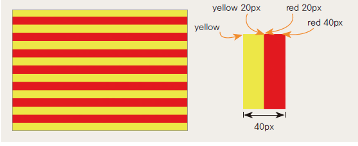

```html
<style>
    .grad2 {
        background: red;
        /* css3 미지원 브라우저 */
        background: -webkit-repeating-linear-gradient(yellow, yellow 20px, red 20px, red 40px);
        /* 초기 모던 브라우저 */
        background: -moz-repeating-linear-gradient(yellow, yellow 20px, red 20px, red 40px);
        /* 초기 모던 브라우저 */
        background: -o-repeating-linear-gradient(yellow, yellow 20px, red 20px, red 40px);
        /* 초기 모던 브라우저 */
        background: repeating-linear-gradient(yellow, yellow 20px, red 20px, red 40px);
        /* 최신 모던 브라우저 */
    }
</style>
```

# 테두리 스타일 시트

- 테두리 속성 테두리 스타일은 텍스트 못지않게 많이 사용되는 스타일이다.
- 테두리 형태, 즉 박스 스타일 이라고도 한다.
- 이미지나 텍스트, 표 등의 테두리를 조절할 때 여기에서 소개하는 border 관련 스타일을 사용하면 된다.
- 스타일 시트 중 여러 가지 효과에서 자주 사용되는 스타일 속성들이다.
- 테두리 스타일이란 텍스트나 이미지 등이 나타나는 실제 콘텐츠 영역, 상자와 콘텐츠 영역 사이의 안 여백(padding), 상자의 테두리선(border), 그리고 상자 주변의 여백(margin) 등과 관련된 스타일이다.

## 테두리 속성

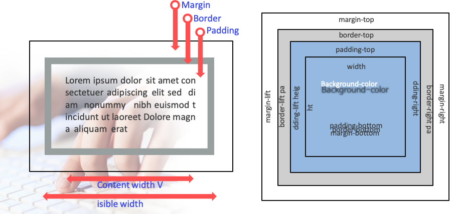

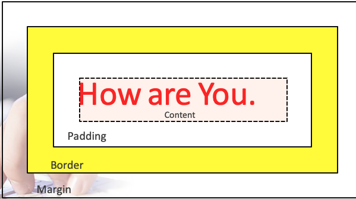

## margin (margin-top, right, bottom, left)

- 이 속성은 나열한 순서대로 요소의 상단 여백, 오른쪽 여백, 하단 여백, 왼쪽 여백을 설정하고, margin 속성은 앞의 네 가지 속성을 한데 묶어 놓은 것이다.
- margin 속성에 값이 하나만 지정되면 그 값이 네 군데 여백 모두에 지정되고 값이 두개나 세 개 뿐이라면 빠진 값은 반대편 여백 값을 사용한다.

```html
<style>
    H1 {
        margin-top: 2cm
    }

    P {
        margin-top: 2cm;
        margin-right: 1cm;
        margin-bottom: 3cm;
        margin-left: 4cm
    }

    BODY {
        margin: 2cm
    }

    /* 모든 여백을 2cm로 설정한다. */
    BODY {
        margin: 1cm 2cm
    }

    /* 상단과 하단은 1cm, 왼쪽과 오른쪽은 2cm */
    BODY {
        margin: 1cm 2cm 3cm
    }

    /* 상단 1cm, 오른쪽 2cm, 하단 3cm, 왼쪽 2cm */
</style>
```

## padding (padding-top, right, bottom, left)

- 이 속성들은 순서대로 요소의 상단 안 여백과 오른쪽 안 여백, 하단 안 여백, 그리고 왼쪽 안 여백을 지정하고 padding 속성은 네 가지 안 여백 값을 한꺼번에 설정한다.
- 안 여백 들의 값은 음수를 사용할 수 없다.
- padding 속성의 값이 네 개일 경우 차례대로 상단, 오른쪽, 하단, 왼쪽의 안 여백을 지정하고 값이 하나뿐이라면 네 군데 안 여백을 똑같은 값으로 설정한다.
- 값이 두 개나 세 개 뿐이라면 빠진 값은 반대편 안 여백 값을 사용한다. 안 여백 공간의 배경색은 background 속성을 사용해서 지정할 수 있다.

```html
<style>
    BLOCKQUOTE {
        padding-top: 0.3cm
    }

    H1 {
        background: white;
        padding: 1cm 2cm
    }

    /* 상하 안 여백은 1cm로, 좌우 안 여백은 2cm로 */
</style>
```

## border-width

- 이 속성들은 순서대로 상단, 오른쪽, 하단, 왼쪽의 테두리 굵기를 지정하고 border-width 속성은 네 가지 테두리 굵기를 한꺼번에 지정한다.
- 직접 크기를 입력하기도 하지만 thin, medium, thick 같은 키워드 중에서 하나를 선택해도 된다. 그 굵기는 thin < medium < thick 순이다.
- 테두리 굵기는 음수 값을 사용할 수 없다.
- border-width의 속성 값이 네 개일 경우 차례대로 상단, 오른쪽, 하단, 왼쪽의 테두리 굵기하고 값이 하나뿐이라면 네 군데 테두리 굵기를 같은 값으로 설정한다.
- 값이 두 개나 세 개 뿐이라면 빠진 값은 반대편 테두리 굵기 값을 사용한다.

```html
<style>
    H1 {
        border-top-width: 1em;
        border-right-width: 2em;
        border-bottom-width: 1em;
        border-left-width: 2em
    }

    H1 {
        border-width: thin thick
    }

    /* thin thick thin thick */
    H1 {
        border-width: thin thick medium
    }

    /* thin thick medium thick */
</style>
```

## border-color

- 순서대로 상단, 오른쪽, 왼쪽, 그리고 왼쪽 테두리선의 색상을 지정하고 마지막 속성 border-color는 네 가지 테두리선 색상을 한꺼번에 설정한다.
- border-color 속성은 한 개에서 네 개까지 값을 가질 수 있다.
- 이 속성에 대한 값이 지정되어 있지 않을 경우 해당 요소의 color 속성 값을 테두리선 색상으로 사용한다.

```html
<style>
    body {
        margin: 50px;
        text-align: center;
    }

    .a {
        border: 5px solid #f00;
        width: 500px;
        height: 50px;
    }

    .b {
        border: 5px solid #0f0;
        width: 500px;
        height: 50px;
    }

    .c {
        border: 5px solid #00f;
        width: 500px;
        height: 50px;
    }
</style>

<body>
    <p class=a><br>The border-style property specifies what kind of border to display.</p>
    <p class=b><br>The border-style property specifies what kind of border to display.</p>
    <p class=c><br>The border-style property specifies what kind of border to display.</p>
</body>
```

## border-style

- 이 속성들은 테두리선의 스타일(solid, double, dashed, 등)을 지정한다.
- 테두리선 스타일로 사용할 수 있는 값은 다음과 같다.
- 테두리선 스타일의 기본값이 none이므로 스타일 시트에서 테두리 스타일을 지정하지 않으면 테두리선은 보이지 않는다.
    
    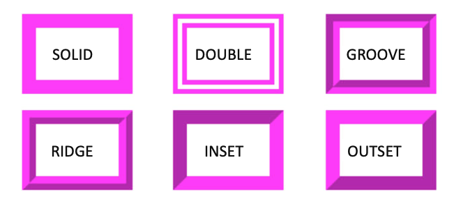
    

```html
<STYLE>
    P {
        border: 15px magenta;
        width: 50px;
        padding: 20px;
        font-size: 15px
    }
</STYLE>

<BODY>
    <TABLE WIDTH="484">
        <TR>
            <TD height="38" colspan="3">테두리선들의 폭은 모두 15px로 동일</TD>
        </TR>
        <TR>
            <TD width="160" height="117">
                <P STYLE="border-style:solid;">SOLID</P>
            </TD>
            <TD width="161">
                <P STYLE="border-style:double;">DOUBLE</P>
            </TD>
            <TD width="147">
                <P STYLE="border-style:groove;">GROOVE</P>
            </TD>
        </TR>
        <TR>
            <TD>
                <P STYLE="border-style:ridge;">RIDGE</P>
            </TD>
            <TD>
                <P STYLE="border-style:inset;">INSET</P>
            </TD>
            <TD>
                <P STYLE="border-style:outset;">OUTSET</P>
            </TD>
        </TR>
    </TABLE>
</BODY>
```

## border

- 각 방향 별로 스타일을 지정한다.
- border 속성은 한꺼번에 네 방향의 테두리선 스타일을 묶어서 지정한다.
- margin 속성이나 padding 속성에서는 네 가지 방향의 값을 서로 다르게 설정할 수 있지만 border 속성에서는 네 가지 방향 모두 같은 굵기나 같은 스타일, 같은 색상을 사용해야 한다.
- 만일 네 가지 방향의 테두리선을 다르게 지정하고 싶다면 border 속성이 아닌, 앞에서 설명한 다른 속성을 사용한다.

```html
<style>
    H1 {
        border-bottom: thick solid red
    }

    /* 아래 테두리선의 스타일을 지정함 */
    P {
        border: solid red
    }

    BLOCKQUOTE {
        border-top: solid red;
        border-right: dotted blue;
        border-bottom: solid red;
        border-left: dotted blue
    }
</style>
```

## border-style application

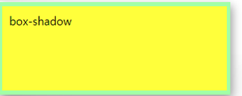

```html
<style>
    div {
        border: 6px solid #aaffaa;
        width: 300px;
        height: 100px;
        background-color: yellow;
        padding: 10px;
        box-shadow: 5px 5px 10px #888888;
    }
</style>

<body>
    <div>box-shadow</div>
</body>
```

## 밴더프리픽스(Vendor Prefix)

- 웹브라우저의 공급업체인 마이크로소프트, 모질라, 구글, 애플, 오페라에서 제공하는 실험적인 기능을 사용할 때 사용되는 접두어이다.
- 이 벤더프리픽스는 CSS3가 표준으로 자리잡지 않았을 때 모든 브라우저에서 안정적으로 보여지도록 만들기 위해 탄생한 것으로 지금은 대부분의 브라우저에서 벤더프리픽스 없이 구동이 가능하지만 구형 브라우저를 위해서 사용하기도 한다.
    
    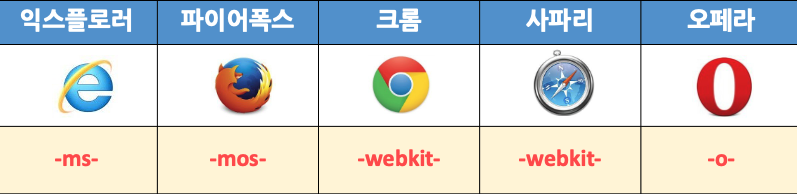
    
    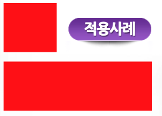
    
    ```html
    <style>
        div {
            width: 100px;
            height: 100px;
            background: red;
            transition-duration: 0.5s;
            -ms-transition-duration: 0.5s;
            -webkit-transition-duration: 0.5s;
            -moz-transition-duration: 0.5s;
            -o-transition-duration: 0.5s;
        }
    
        div:hover {
            width: 300px;
        }
    </style>
    <div></div>
    ```
    

## 이미지 변경

- 일반 이미지를 가지고 사진 인화지의 효과를 내기 위해서는 조금 복잡하지만 지금까지 배운 내용들을 최대한 응용하면 나타낼 수 있다.
- 배경이미지와 이미지 회전, 그림자, 테두리의 응용을 통해서 실습해 본다.


```html
<style>
    BODY {
        margin: 100px;
        background: url(pattern_e.jpg) center repeat fixed
    }

    /*배경 패턴이미지*/
    img {
        background: white;
        padding-top: 10px;
        padding-bottom: 60px;
        padding-left: 10px;
        padding-right: 10px;
        box-shadow: 5px 5px 10px #000000;
    }

    /*사진 프린트 효과와 그림자*/
    .text_box {
        position: absolute;
        margin-top: 430px;
        margin-left: 220px;
        width: 220px;
        text-align: center;
        font-size: 18px;
        border-bottom: 1px solid black;
    }

    /*사진 하단부 텍스트와 밑줄*/
    .img_rotate {
        transform: rotate(-5deg);
        -ms-transform: rotate(-5deg);
        /* IE 9 */
        -webkit-transform: rotate(-5deg);
        /*Safari and Chrome */
    }

    /*이미지 회전*/
</style>

<body>
    <div class=img_rotate>
        <div class=text_box>Lovely Baby 2013.10.17</div> 
    </div>
</body>
```

## 배경속성 / background-image 속성

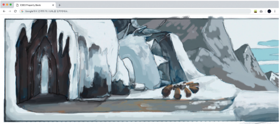

```html
<!DOCTYPE html>
<html lang="en">
<head>
    <meta charset="UTF-8">
    <meta http-equiv="X-UA-Compatible" content="IE=edge">
    <meta name="viewport" content="width=device-width, initial-scale=1.0">
    <title>Document</title>
    <style>
        body{
            background-image: url("BackgroundFront.png");
        }
    </style>
</head>
<body>
    
</body>
</html>
```

- CSS3 이전에는 이렇게 배경 이미지를 1개씩만 적용할 수 있었음
- 그러나 CSS3부터는 여러 개의 배경 이미지 적용이 가능해짐
- 여러 개의 배경을 적용할 경우에는 왼쪽에 위치한 이미지가 앞으로 나오게 됨
- 코드를 실행하면 2개의 이미지가 층을 이루어 출력됨

## 배경 속성 / background-size 속성

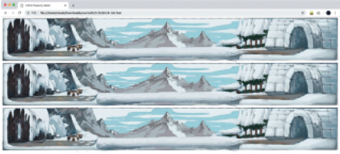

```html
<!DOCTYPE html>
<html lang="en">
<head>
    <meta charset="UTF-8">
    <meta http-equiv="X-UA-Compatible" content="IE=edge">
    <meta name="viewport" content="width=device-width, initial-scale=1.0">
    <title>Document</title>
    <style>
        body{
            background-image: url("BackgroundFront.png"), url("BackgroundFront.png");
            background-size: 100% 250px;
        }
    </style>
</head>
<body>
    
</body>
</html>
```

- 그림 크기를 조절할 때는 background-size 속성을 사용: 인터넷 익스플로러 8 이하에선 사용 불
- background-size 속성은 1개 또는 2개의 크기 단위를 적용하며 각각 너비와 높이를 의미
- 좌측 코드의 출력: 높이에 250픽셀 적용
- 쉼표를 사용해 크기 단위를 적용하면 BackgroundFront.png 파일은 너비가 100%로 적용

## 배경 속성 / background-repeat 속성

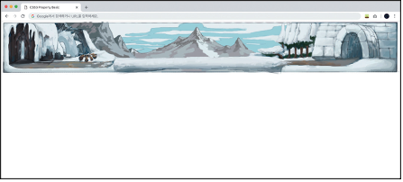

```html
<!DOCTYPE html>
<html lang="en">
<head>
    <meta charset="UTF-8">
    <meta http-equiv="X-UA-Compatible" content="IE=edge">
    <meta name="viewport" content="width=device-width, initial-scale=1.0">
    <title>Document</title>
    <style>
        body{
            background-image: url("BackgroundFront.png"), url("BackgroundFront.png");
            background-size: 100% 250px;
            background-repeat: no-repeat;
        }
    </style>
</head>
<body>
    
</body>
</html>
```

- background-repeat 속성의 기본 키워드가 repeat: 그림이 패턴을 이루어 여러 개 출력
- repeat 키워드를 적용하면 이미지가 패턴을 이루게 됨
- repeat-x 키워드를 적용하면 X축 방향으로 이미지가 반복
- repeat-y 키워드를 적용하면 Y축 방향으로 이미지가 반복

## 그림자 속성 / text-shadow 속성

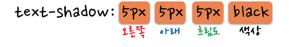

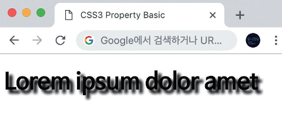

```html
<!DOCTYPE html>
<html lang="en">
<head>
    <meta charset="UTF-8">
    <meta http-equiv="X-UA-Compatible" content="IE=edge">
    <meta name="viewport" content="width=device-width, initial-scale=1.0">
    <title>Document</title>
    <style>
        h1{
            text-shadow: 5px 5px 5px black;
        }
    </style>
</head>
<body>
    <h1>Lorem ipsum dolor amet</h1>
</body>
</html>
```

## 그림자 속성 / box-shadow 속성

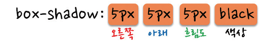

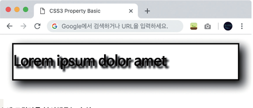

```html
<!DOCTYPE html>
<html lang="en">
<head>
    <meta charset="UTF-8">
    <meta http-equiv="X-UA-Compatible" content="IE=edge">
    <meta name="viewport" content="width=device-width, initial-scale=1.0">
    <title>Document</title>
    <style>
        div{
            border: 3px solid black;
            box-shadow: 10px 10px 38px black;
            text-shadow: 5px 5px 5px black;
        }
    </style>
</head>
<body>
    <h1>Lorem ipsum dolor amet</h1>
</body>
</html>
```